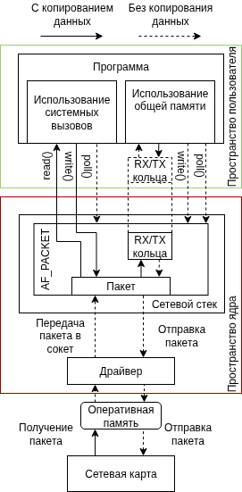
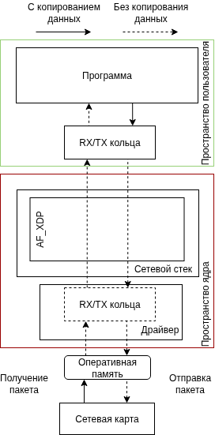
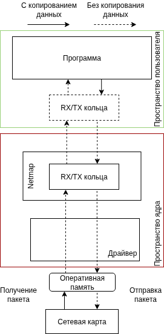
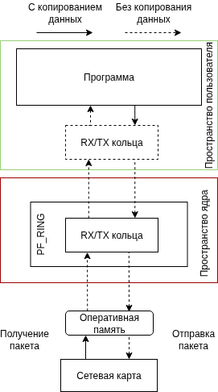
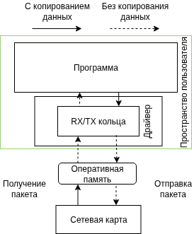

# Обзор систем захвата сетевого трафика

***

В данном разделе будут рассмотрены основные системы захвата сетевого трафика и определены те, которые являются наиболее универсальными, доступными и поддерживаемыми для применения в отечественных решениях.
Обзор системы строиться по следующему плану:

- Историческая справка;
- Доступность исходного кода;
- Лицензия распространения;
- Объем поддерживаемых устройств;
- Схема передачи сетевого трафика.

***

1. [AF_PACKET](#af_packet)
2. [AF_XDP](#af_xdp)
3. [Netmap](#netmap)
4. [PF_RING](#pf_ring)
5. [DPDK](#dpdk)
6. [Заключение](#заключение)
7. [Полезные материалы](#полезные-материалы)
8. [Источники](#источники)

***

## AF_PACKET

При упоминании термина «захват сетевых пакетов» первое, что приходит на ум большинству — это программы «Wireshark» [1], «Tcpdump» [2] или библиотека «Libpcap». Но все эти механизмы захвата сетевого трафика основываются на подсистеме «AF_PACKET» ядра «Linux» [3].

Первая версия подсистемы появилась в версии ядра 2.0 в 1996 году, позволяя получать в пользовательском пространстве пакеты сетевого уровня с заголовком IP, что ограничивало практическое использование подсистемы. Сейчас же «AF_PACKET» предоставляет гибкий интерфейс для захвата и отправки сетевых пакетов на канальном уровне и сетевом уровне [4].

Исходный код системы доступен в репозитории ядра «Linux» по пути `linux/net/packet` и распространяется открыто под лицензией «GPL-2.0» [5]. Но применение данной системы в пользовательских программах через системные вызовы ядра «Linux» не наклакладывает на разработчиков требования лицензии «GPL-2.0», что позволяет, например, распространять библиотеку «Libpcap» под лицензией «BSD» [6].

Объем поддерживаемых устройств у системы такой же, как и у ядра «Linux», так как система работает на уровне сетевого стека, что позволяет ей быть независимой от реализации драйвера сетевого интерфейса [5].

## AF_XDP

Из упомянутой в анализе системы «AF_PACKET» презентации о реализации «zero-copy» (запись пакетов сетевым устройством напрямую в пространство пользователя) и о создании четвёртой версии «AF_PACKET» через год в 2018 году родилось исследование «The Path to DPDK Speeds for AF XDP» [7], в котором разбирается устройство новой подсистемы ядра «Linux», реализующей «zero-copy» в исходном коде ядра.

Реализация в исходном коде ядра «Linux» обязует систему распространяться под лицензией «GPL», что позволяет свободно читать, модифицировать и использовать систему «AF_XDP».

Но у системы есть особенность: «zero-copy» режим возможен только при поддержке драйвером сетевого устройства. Иначе используется реализация системы на основе данных структур `sk_buff`, что уже использует два копирования пакета для передачи его в пользовательское пространство [8]. Таким образом, система поддерживает аналогично «AF_PACKET» все сетевые устройства, которые умеют работать с сетевым стеком ядра «Linux», но обеспечивает разную производительность.

## Netmap

Система «Netmap» была создана в 2011 году для систем «BSD» и позже была добавлена поддержка ядра «Linux». Код системы является открытым и распространяется под лицензией «BSD», что не нагладывает никаких ограничений на использование кода. Ещё до появления «AF_XDP» система решала проблему захвата высокоскоростного трафика, реализовав «zero-copy» и убрав лишние системные вызовы, но из-за гораздо меньшего количества человек, принимающих участие в разработке, количество поддерживаемых утройств ограничилось сетевыми устройствами от компании «Intel». Сегодня ситуация не изменилась [9].

## PF_RING

Система «PF_RING» также, как и «Netmap» или «AF_XDP», окончательно сформировалась в прошлом десятилетии, но в отличии от прошлых систем она имеет 2 версии [10]:
1. Бесплатная версия с открытым кодом, которая распространяется под лицензией «LGPL-2.1» и является интерфейсом над «AF_PACKET» или «AF_XDP»;
2. Платная версия с закрытым исходными кодом, которая реализует «zero-copy» режим.

Так как бесплатная версия основана на сетевом стеке ядра «Linux», то она поддерживает все доступные ядру устройства, тогда как платная версия может работать с сетевыми устройствами всех основных производителей: «Intel», «Nvidea», «NVIDIA/Mellanox» и тд.

## DPDK

История системы «DPDK» началась в 2010 году с разработок компании «Intel», в 2013 году компания открыла код, а в 2017 система начала развиваться под управлением «The Linux Foundation». За это время система стала стандартом, если необходимо обеспечивать пропускную способность в сотни гигабит в секунду [1].

Система распространения под лицензией «BSD-3-Clause», что позволяет её использовать и изменять без ограничений. Кроме того, благодаря реализации драйверов в пользовательском пространстве через примененее механизма «VFIO» разработка драйвером упрощается и система содержится драйвера практически для всех сетевых устройств, которые имеют подключение через «PCI-Express».

## Заключение

Для применения в отечественных решения однозначно не подходит система «PF_RING» ввиду санкций. Кроме того, из-за ограниченности драйверов и схожего принципа работы с «AF_XDP» не подходит система «Netmap». Таким образом, можно выделить следующие сценарии использования оставшихся систем:

1. система «AF_PACKET» применяется, если требуемая пропускная способность сети не превышает 10 Гб/с;
2. система «AF_XDP» применяется, если требуемая пропускная способность сети не превышает 100 Гб/с;
3. система «DPDK» применяется, если требуемая пропускная способность сети превышает 100 Гб/с.

## Полезные материалы

## Источники

1. [Описание Wireshark для систем на базе ядра Linux](https://github.com/wireshark/wireshark/blob/master/README.linux)
2. [Описание Tcpdump](https://github.com/the-tcpdump-group/tcpdump/blob/master/README.md)
3. [Исходный код захвата пакетов библиотекой Libpcap](https://github.com/the-tcpdump-group/libpcap/blob/master/pcap-linux.c)
4. [Описание системы AF_PACKET](https://man7.org/linux/man-pages/man7/packet.7.html)
5. [Исходный код системы AF_PACKET](https://github.com/torvalds/linux/tree/master/net/packet)
6. [Лицензия библиотеки Libpcap](https://github.com/the-tcpdump-group/libpcap/blob/master/LICENSE)
7. [Magnus Karlsson and Bjorn T «The Path to DPDK Speeds for AF XDP»](http://oldvger.kernel.org/lpc_net2018_talks/lpc18_paper_af_xdp_perf-v2.pdf)
8. [Документация ядра «Linux» о «AF_XDP»](https://docs.kernel.org/networking/af_xdp.html)
9. [Исходный код системы «Netmap»](https://github.com/luigirizzo/netmap?tab=readme-ov-file#references)
10. [Официальный сайт системы «PF_RING»](https://www.ntop.org/products/packet-capture/pf_ring)
11. [Официальный сайт системы «DPKD»](https://www.dpdk.org/about/)