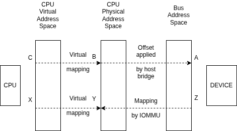

# Основы работы сетевого стека ядра Linux

***

В данном разделе разбирается устройство сетевого стека ядра Linux от сетевой карты до сокетов.

***

1. [Драйвер сетевой карты](#драйвер-сетевой-карты)
	1. [Основные механизмы и технологии](#основные-механизмы-и-технологии)
       1. [DMA](#dma)
       2. [DCA](#dca)
       3. [SoftIRQ](#softirq)
       4. [NAPI](#napi)
	2. [Установка и удаление](#установка-и-удаление)
	3. [Получение сетевых пакетов](#получение-сетевых-пакетов)
	4. [Отправка сетевых пакетов](#отправка-сетевых-пакетов)
2. [Сокеты ядра Linux](#сокеты-ядра-linux)
3. [Полезные материалы](#полезные-материалы)
4. [Источники](#источники)

***

## Драйвер сетевой карты

В ядре «Linux» существует только три типа устройств [1]:
 - символьные устройства;
 - блочные устройства;
 - сетевые интерфейсы.

За работу сетевого интерфейса отвечает устройство NIC (Network interface controller) или сетевая карта — это аппаратный компонент, который устанавливается в компьютер или сервер для подключения к локальной сети (LAN) [2]. В эталонной модели OSI сетевая карта отвечает не только за работу физического уровня, определяя способ передачи сетевых пакетов, но и за канальный уровень, управляя получаемыми и отправляемыми кадрами. Для этого устройство выполняет следующие функции:

1. формирование кадров и проверка хеш-сумм;
2. запись кадров в оперативную память;
3. фильтрация трафика по адресам;
4. генерация прерываний;
5. аппаратное ускорение обработки пакетов.

Для управления сетевой картой и обеспечением доступа к передаваемым пакетам используется драйвер сетевой карты. Его реализация зависит от используемой операционной системы, но его выполняемые функции остаются общими:

1. инициализация сетевой карты и управление её параметрами;
2. регистрация устройства в ядре операционной системе;
3. обработка прерываний;
4. запись и чтение кадров.

Ядро Linux является монолитным с поддержкой модулей ядра [2]. Модули ядра могут выполнять различные функции от реализации драйверов (модуль «IGB» [3]) и файловых систем (модуль «BTRFS» [4]) до виртуализации (модуль «KVM» [5]), поэтому далее понятия модуля ядра и драйвера будут одним и тем же. Дальнейшее описание работы драйверов сетевых карт будет основано на реализацииЫ модуля «IGB», так как его работу можно эмулировать в системе виртуализации «QEMU» (см. [создание песочницы](Sandbox-qemu.md)).

### Основные механизмы и технологии

Рассмотрим основные механизмы и технологии, которые применяются при работе сетевой карты.

#### DMA

DMA (Direct Memory Access) — это технология, позволяющая устройствам ввода/вывода читать и записывать данные в оперативную память напрямую, без участия центрального процессора (CPU) [6].



На рисунке показана схема отображения памяти при использовании DMA [6]. Процесс выглядит так:

1. Считывание адреса шины A из шины памяти устройства и преобразование его в физический адрес процессора B (хранится в `struct resource`);
2. Сопоставление физического адреса B с виртуальным адресом C с помощью функции `ioremap`;
3. Использование функций чтения и записи (например, ioread32(C) или iowrite32(C) [7]) для доступа к регистрам устройства по адресу шины A.

Работу DMA определяет маска, которая отражает количество разрядов памяти, поддерживаемых устройством, а также тип операции: синхронный (когерентный) или асинхроннный (потоковый). В случае синхронных операций чтение и запись в память происходит синхронно для устройства и процессора, тогда как для асинхроннных операций действия с памятью происходять независимо. Для настройки DMA используются функции `dma_set_mask`, которая настраивает маску для асинхроннных операций, `dma_set_coherent_mask`, которая настраивает маску для синхронных операций, или `dma_set_mask_and_coherent`, которая настраивает маску сразу для обоих операций [6].

#### DCA

Технология DCA (Direct Cache Access) является развитием DMA, так как её целью является ускорение операций работы с памятью. Для работы требуется три структуры данных, которые содержат: состояние, дескрипторы и полезную нагрузку. Они выделяются из физической памяти и кэшируются в кэш-памяти процессора [8].

Принцип работы следующий [8]:

1. Связующим звеном для чтения и записи в кэш-память процессора является микрочип, присутствующий на устройстве;
2. При записи данных строка байт в кэш-памяти становится недействительной и записывается в память устройства;
3. При чтении данных строка в кэш-памяти становится недействительной и заменяется на новую.

DCA имеет два преимущества:

1. Cнижение средней задержки работы с энергозависимой памятью;
2. Снижениютребований к пропускной способности энергозависимой памяти.

#### SoftIRQ

Одним из принципов разработки драйверов является то, что обработка прерывания должна занимать как можно меньшее время, так как при длительной обработке повышается шанс пропустить следующее прерывание. Но обработать большое количество сетевого трафика за небольшое время является невозможным. Поэтому была придуман механизм «SoftIRQ». Его принцип работы заключается в том, чтобы перенести долгую обработку данных из контекса прерывания в контекст потока ядра. Отложенная обработка происходит либо по таймеру за потоков ядра (по одному на каждый логический процессор), либо при окончании системного вызова [9].

За выполнение обработки прерываний отвечают потоки ядра с названиями `ksoftirqd/N`, где `N` — это номер логического процессора, прерывания которого обрабатываются этим потоком. Также статистику по работе этих потоков можно изучить через файл `/proc/softirqs`.

#### Буферы сокетов

Основной структурой для передачи сетевых данных в ядре «Linux» является структура `sk_buff`. Структуру можно разделить на две части: данные управления и данные пакета. Данные пакета могут находится как в самой структуре, так и в отдельных участках памяти (фрагментах). В самой структуре может хранится весь пакет, если он небольшой (менее 256 байт), в иных случаях в структуру записываются указатели на фрагменты данных [1].

```c
// linux/include/linux/skbuff.h
// Пример структуры sk_buff.
struct sk_buff {
	/* ... */

	// Данные управления.
	// Указатели на буферы для управления
	// двухнаправленным списком.
	struct sk_buff *next;
	struct sk_buff *prev;

	/* ... */

	// Указатель на сетевой интерфейс источника.
	struct net_device	*dev;

	/* ... */

	// Смещения до данных каждого уровня.
	__u16 transport_header;
	__u16 network_header;
	__u16 mac_header;

	/* ... */

	// Указатели на дополнительные фрагменты пакета.
	sk_buff_data_t		tail;
	sk_buff_data_t		end;

	// Указатели на данные.
	unsigned char *head, *data;

	/* ... */
};
```

Основное свойство данной структуры — универсальность. Структура создаётся при приёме пакетов или отправке пакетов через сетевой интерфейс, проходя путь от пользовательского приложения до сетевой карты.

#### NAPI

NAPI — это технология обработки событий, используемая сетевым стеком Linux. В её основе лежит идея получения пакетов набором с помощью функции опроса `napi_poll`, которая проверяет наличие пакетов и обрабатывает их. Технология была создана для увеличения пропускной способности сетевых интерфейсов, так как обработка прерываний для каждого отдельного пакета при высокой скорости трафика создаёт много лишних накладных расходов.

Регистрация и удаление NAPI в драйвере происходит с помощью функций `netif_napi_add` и `netif_napi_del` соответственно. После этого возможность запуска функции `napi_poll` регулируется функциями `napi_enable` и `napi_disable`. Функция `napi_poll` может быть вызвана по следующим причинам:

1. Аппаратное прерывание;
2. Таймер;
3. Системное вызов (например, epoll).

### Установка и удаление

Каждое подключенное устройство, например, по шине PCI (Peripheral component interconnect) или по USB (Universal Serial Bus) имеет два численных индекса [1]:

1. VID (Vendor ID) — численный индекс производителя;
2. PID (Product ID) или DID (Device ID) — численный индекс продукта.

Эта пара индексов отвечает за обнаружение драйвером устройства, с которым он умеет работать. Чтобы понять, с какими устройствами может работать драйвер, необходимо найти список структур «pci_device_id», в котором перечислены пары VID и PID поддерживаемых устройств.

```c
// contrib/linux-6.18/drivers/net/ethernet/intel/igb/e1000_hw.h
// Пример индексов PID.
#define E1000_DEV_ID_I354_BACKPLANE_1GBPS	0x1F40
#define E1000_DEV_ID_I354_SGMII			0x1F41
```

```c
// contrib/linux-6.18/drivers/net/ethernet/intel/igb/igb_main.c
// Пример списка поддерживаемых устройств драйвера «IGB».
static const struct pci_device_id igb_pci_tbl[] = {
	{ PCI_VDEVICE(INTEL, E1000_DEV_ID_I354_BACKPLANE_1GBPS) },
	{ PCI_VDEVICE(INTEL, E1000_DEV_ID_I354_SGMII) },
	/* ... */
	{0, }
};

// Регистрация списка в системе через файл
// /lib/modules/$(uname -r)/modules.alias
MODULE_DEVICE_TABLE(pci, igb_pci_tbl);
```

После загрузки модуля, например, c помощью команд `insmod` или `modprobe` выполняется функция, которая передается в макрос `module_init`.

```c
// contrib/linux-6.18/drivers/net/ethernet/intel/igb/igb_main.c
// Cписок дополнительных операций над модулем.
static _DEFINE_DEV_PM_OPS(igb_pm_ops, igb_suspend, igb_resume,
			  igb_runtime_suspend, igb_runtime_resume,
			  igb_runtime_idle);

// Структура с информацией о модуле и основными операциями.
static struct pci_driver igb_driver = {
	// Имя модуля.
	.name     = igb_driver_name,
	// Поддерживаемые устройства.
	.id_table = igb_pci_tbl,
	// Функция регистрация устройства.
	.probe    = igb_probe,
	// Функция удаления устройства.
	.remove   = igb_remove,
	// Передача дополнительных функций.
	.driver.pm = pm_ptr(&igb_pm_ops),
	// Функция приостановки устройства.
	.shutdown = igb_shutdown,
	/* ... */
};

// Пример установки модуля.
static int __init igb_init_module(void)
{
	/* ... */
	// Установка структуры с данными драйвера.
	ret = pci_register_driver(&igb_driver);
	/* ... */
}

// Регистрация функции установки модуля.
module_init(igb_init_module);
```

После того, как модуль будет установлен в ядро, запустится функция `igb_probe` (`igb_driver.probe`) для каждого поддерживаемого устройства, которая выполнит их инициализацию. Для драйвера «IGB» устройствами будут являться сетевые интерфейсы. Их инициализация состоит из следующих шагов:

1. Инициализация PCI-устройства [6];
2. Установка маски DMA (см. [DMA](#dma)) [7];
3. Резервирование участков памяти [6];
4. Захват шины PCI для управления устройством [6];
5. Создание и заполнение структуры «net_device» для регистрации сетевого интерфейса [8];
6. Регистрирация поддерживаемых функций ethtool (см. [настройка и тестирование](Settings-and-testing.md));
7. Настройка прерываний и подсистемы NAPI (см. [NAPI](#napi)) [9];
8. Настройка наблюдателя, который перезагружает сетевой интерфейс в случае проблем;
9. Установка новых настроек интерфейса;
10. Регистрация интерфейса в сетевой части ядра;
11. Получение прямого доступа к управлению интерфейсом;
12. Инициализация технологии DCA (см. [DCA](#dca)) [10];
13. Множество других настроек в зависимости от конфигурации и устройства.

```c
// contrib/linux-6.18/drivers/net/ethernet/intel/igb/igb_main.c
// Структура с операциями над сетевым интерфейсом.
static const struct net_device_ops igb_netdev_ops = {
	.ndo_open		= igb_open,
	.ndo_stop		= igb_close,
	.ndo_start_xmit		= igb_xmit_frame,
	.ndo_get_stats64	= igb_get_stats64,
	.ndo_set_rx_mode	= igb_set_rx_mode,
	.ndo_set_mac_address	= igb_set_mac,
	.ndo_change_mtu		= igb_change_mtu,
	.ndo_eth_ioctl		= igb_ioctl,
	/* ... */
};
```

```c
// contrib/linux-6.18/drivers/net/ethernet/intel/igb/igb_ethtool.c
// Структура с операциями над сетевым интерфейсом при помощи ethtool.
static const struct ethtool_ops igb_ethtool_ops = {
	/* ... */
	.get_drvinfo		= igb_get_drvinfo,
	.get_regs_len		= igb_get_regs_len,
	.get_regs		= igb_get_regs,
	.get_wol		= igb_get_wol,
	.set_wol		= igb_set_wol,
	.get_msglevel		= igb_get_msglevel,
	.set_msglevel		= igb_set_msglevel,
	.nway_reset		= igb_nway_reset,
	.get_link		= igb_get_link,
	.get_eeprom_len		= igb_get_eeprom_len,
	.get_eeprom		= igb_get_eeprom,
	.set_eeprom		= igb_set_eeprom,
	.get_ringparam		= igb_get_ringparam,
	/* ... */
};
```

```c
// src/igb_main.c
// Пример инициализации устройства
static int igb_probe(struct pci_dev *pdev,
			       const struct pci_device_id *ent)
{
	/* ... */
	struct net_device *netdev;
	struct igb_adapter *adapter;
	int err;
	/* ... */
	// Инициализация PCI-устройства
	err = pci_enable_device_mem(pdev);
	if (err)
		return err;

	// Установка маски DMA
	err = dma_set_mask(pci_dev_to_dev(pdev), DMA_BIT_MASK(64));
	if (!err) {
		err = dma_set_coherent_mask(pci_dev_to_dev(pdev),
			DMA_BIT_MASK(64));
		if (!err)
			pci_using_dac = 1;
	} else {
		err = dma_set_mask(pci_dev_to_dev(pdev), DMA_BIT_MASK(32));
		if (err) {
			err = dma_set_coherent_mask(pci_dev_to_dev(pdev),
				DMA_BIT_MASK(32));
			if (err) {
				IGB_ERR(
				  "No usable DMA configuration, aborting\n");
				goto err_dma;
			}
		}
	}

	/* ... */

	// Резервирование участков памяти
	err = pci_request_selected_regions(pdev,
					  pci_select_bars(pdev,
							  IORESOURCE_MEM),
					  igb_driver_name);
	if (err)
		goto err_pci_reg;

	/* ... */

	// Захват шины PCI для управления устройством
	pci_set_master(pdev);

	/* ... */

	// Создание и заполнение структуры net_device для регистрации сетевого интерфейса
	netdev = alloc_etherdev_mq(sizeof(struct igb_adapter),
				   IGB_MAX_TX_QUEUES);

	/* ... */

	if (!netdev)
		goto err_alloc_etherdev;

	SET_MODULE_OWNER(netdev);
	SET_NETDEV_DEV(netdev, &pdev->dev);

	pci_set_drvdata(pdev, netdev);
	adapter = netdev_priv(netdev);
	adapter->netdev = netdev;
	adapter->pdev = pdev;
	hw = &adapter->hw;
	hw->back = adapter;
	adapter->port_num = hw->bus.func;
	adapter->msg_enable = GENMASK(debug - 1, 0);

	/* ... */

#ifdef HAVE_NET_DEVICE_OPS
	netdev->netdev_ops = &igb_netdev_ops;
#endif /* HAVE_NET_DEVICE_OPS */

	// Регистрирация поддерживаемых функций ethtool
	igb_set_ethtool_ops(netdev);

	/* ... */

	// Настройка прерываний и подсистемы NAPI
	// igb_sw_init вызывает igb_init_interrupt_scheme
	// igb_init_interrupt_scheme вызывает igb_alloc_q_vectors
	// igb_alloc_q_vectors вызывает igb_alloc_q_vector
	// igb_alloc_q_vector вызывает netif_napi_add
	err = igb_sw_init(adapter);
	if (err)
		goto err_sw_init;

	/* ... */

	// Настройка наблюдателя
	INIT_WORK(&adapter->reset_task, igb_reset_task);
	INIT_WORK(&adapter->watchdog_task, igb_watchdog_task);

	/* ... */

	// Установка новых настроек интерфейса
	igb_reset(adapter);

	/* ... */

	// Получение прямого доступа к управлению интерфейсом
	igb_get_hw_control(adapter);

	// Регистрация интерфейса в сетевой части ядра
	strscpy(netdev->name, "eth%d", IFNAMSIZ);
	err = register_netdev(netdev);
	if (err)
		goto err_register;

	/* ... */

	// Инициализация технологии DCA
#ifdef IGB_DCA
	if (dca_add_requester(&pdev->dev) == E1000_SUCCESS) {
		adapter->flags |= IGB_FLAG_DCA_ENABLED;
		dev_info(pci_dev_to_dev(pdev), "DCA enabled\n");
		igb_setup_dca(adapter);
	}
#endif

	/* ... */

}
```

Далее с помощью функций из структур `net_device_ops` и `ethtool_ops` происходит настройка сетевого интерфейса из пространства пользователя. Так при выполнении команды `ip link set up` выполняется функция `igb_open` (`net_device_ops.ndo_open`). Она выполняет следующее:

1. Получение настроек устройства;
2. Отключение несущей, чтобы исключить параллельную работу интерфейса;
3. Создание колец отправки и получения пакетов;
4. Включение несущей;
5. Инициализация и настройка различных параметров интерфейса;
6. Установка количества очередей отправки и получения пакетов;
7. Перевод интерфейса в включенное состояние;
8. Включение NAPI для каждой очереди;
9. Включение прерываний;
10. Включение возжности отправки пакетов;
11. Запуск наблюдателя.

```c
// src/igb_main.c
// Пример запуска интерфейса
static int __igb_open(struct net_device *netdev, bool resuming)
{
	// Получение настроек устройства
	struct igb_adapter *adapter = netdev_priv(netdev);
	struct e1000_hw *hw = &adapter->hw;

	/* ... */

	// Отключение несущей
	netif_carrier_off(netdev);

	// Создание колец отправки пакетов
	err = igb_setup_all_tx_resources(adapter);
	if (err)
		goto err_setup_tx;

	// Создание колец получения пакетов
	err = igb_setup_all_rx_resources(adapter);
	if (err)
		goto err_setup_rx;

	// Включение несущей
	igb_power_up_link(adapter);

	// Инициализация и настройка различных параметров интерфейса
	igb_configure(adapter);

	// Настройка прерываний
	err = igb_request_irq(adapter);
	if (err)
		goto err_req_irq;

	// Установка количества очередей отправки пакетов
	netif_set_real_num_tx_queues(netdev,
				     adapter->vmdq_pools ? 1 :
				     adapter->num_tx_queues);

	// Установка количества очередей получения пакетов
	err = netif_set_real_num_rx_queues(netdev,
					   adapter->vmdq_pools ? 1 :
					   adapter->num_rx_queues);
	if (err)
		goto err_set_queues;

	// Перевод интерфейса в включенное состояние
	clear_bit(__IGB_DOWN, adapter->state);

	// Включение NAPI для каждой очереди
	for (i = 0; i < adapter->num_q_vectors; i++)
		napi_enable(&(adapter->q_vector[i]->napi));

	/* ... */

	// Включение прерываний
	igb_irq_enable(adapter);

	/* ... */

	// Включение возжности отправки пакетов
	netif_tx_start_all_queues(netdev);

	/* ... */

	// Запуск наблюдателя
	hw->mac.get_link_status = 1;
	schedule_work(&adapter->watchdog_task);

	return E1000_SUCCESS;

	/* ... */

}

int igb_open(struct net_device *netdev)
{
	return __igb_open(netdev, false);
}
```

Cоответсвенно при выполнении команды `ip link set down` будет вызвана функция `igb_close` (`net_device_ops.ndo_close`), которая выполнит следующее:

1. Получение настроек устройства;
2. Переключение устройства в состояние DOWN;
3. Отключение несущей;
4. Остановка отправки пакетов;
5. Отключение NAPI;
6. Отключение прерываний;
7. Обновдение статистики интерфейса;
8. Обновление настроек;
9. Очистка колец отправки и приема пакетов;
10. Освобождение прямого управления устройством;
11. Освобождения памяти дли прерываний;
12. Освобождение памяти для колец отправки и получения пакетов.

```c
// src/igb_main.c
// Пример выключения интерфейса
void igb_down(struct igb_adapter *adapter)
{
	/* ... */

	// Переключение устройства в состояние DOWN
	set_bit(__IGB_DOWN, adapter->state);

	/* ... */

	// Отключение несущей
	netif_carrier_off(netdev);
	// Остановка отправки пакетов
	netif_tx_stop_all_queues(netdev);

	/* ... */

	// Отключение NAPI
	for (i = 0; i < num_q_vectors; i++)
		napi_disable(&(adapter->q_vector[i]->napi));

	// Отключение прерываний
	igb_irq_disable(adapter);

	/* ... */

	// Обновдение статистики интерфейса
	igb_update_stats(adapter);

	adapter->link_speed = 0;
	adapter->link_duplex = 0;

	/* ... */

	// Обновление настроек
	igb_reset(adapter);

	/* ... */

	// Очистка колец отправки и приема пакетов
	igb_clean_all_tx_rings(adapter);
	igb_clean_all_rx_rings(adapter);

#ifdef IGB_DCA
	// Обновление DCA
	igb_setup_dca(adapter);
#endif
}

static int __igb_close(struct net_device *netdev, bool suspending)
{
	// Получение настроек устройства
	struct igb_adapter *adapter = netdev_priv(netdev);
#ifdef CONFIG_PM_RUNTIME
	struct pci_dev *pdev = adapter->pdev;
#endif /* CONFIG_PM_RUNTIME */

	/* ... */

	igb_down(adapter);

	// Освобождение прямого управления устройством
	igb_release_hw_control(adapter);

	// Освобождения памяти дли прерываний
	igb_free_irq(adapter);

	/* ... */

	// Освобождение памяти для колец отправки и получения пакетов
	igb_free_all_tx_resources(adapter);
	igb_free_all_rx_resources(adapter);

	/* ... */

	return 0;
}

int igb_close(struct net_device *netdev)
{
	return __igb_close(netdev, false);
}
```

При завершении работы сетевого драйвера для каждого интерфейса вызывается функция `igb_remove` (`igb_driver.remove`), которая освобождает управление сетевым интерфейсом. Её выполнение состоит из следующих шагов:

1. Переключение устройства в состояние DOWN;
2. Отключение наблюдателя;
3. Отключение технологии DCA;
4. Отключение прямого управления устройством;
5. Удаление интерфейса из сетевой части ядра;
6. Освобождение используемых прерываний;
7. Освободение PCI-устройства.

```c
// src/igb_main.c
// Пример удаления устройства
static void igb_remove(struct pci_dev *pdev)
{
	struct net_device *netdev = pci_get_drvdata(pdev);
	struct igb_adapter *adapter = netdev_priv(netdev);
	struct e1000_hw *hw = &adapter->hw;

	/* ... */

	// Переключение устройства в состояние DOWN
	set_bit(__IGB_DOWN, adapter->state);
	// Отключение наблюдателя
	del_timer_sync(&adapter->watchdog_timer);
	if (adapter->flags & IGB_FLAG_DETECT_BAD_DMA)
		del_timer_sync(&adapter->dma_err_timer);
	del_timer_sync(&adapter->phy_info_timer);

	cancel_work_sync(&adapter->reset_task);
	cancel_work_sync(&adapter->watchdog_task);

	// Отключение технологии DCA
#ifdef IGB_DCA
	if (adapter->flags & IGB_FLAG_DCA_ENABLED) {
		dev_info(pci_dev_to_dev(pdev), "DCA disabled\n");
		dca_remove_requester(&pdev->dev);
		adapter->flags &= ~IGB_FLAG_DCA_ENABLED;
		E1000_WRITE_REG(hw, E1000_DCA_CTRL, E1000_DCA_CTRL_DCA_DISABLE);
	}
#endif

	/* ... */

	// Отключение прямого управления устройством
	igb_release_hw_control(adapter);

	// Удаление интерфейса из сетевой части ядра
	unregister_netdev(netdev);

	// Освобождение используемых прерываний
	igb_clear_interrupt_scheme(adapter);

	/* ... */

	// Освобождение используемой памяти
	pci_release_selected_regions(pdev,
				     pci_select_bars(pdev, IORESOURCE_MEM));

	/* ... */

	kfree(adapter->mac_table);
	kfree(adapter->shadow_vfta);
	free_netdev(netdev);

	/* ... */

	// Освободение PCI-устройства
	pci_disable_device(pdev);
}
```

### Получение сетевых пакетов

Рассмотрим процесс получения сетевых пакетов от работы сетевой карты до передачи их в сетевому стеку ядра Linux.

#### Работа сетевой карты

Основной задачей сетевой карты является запись пришедшего на интерфейс пакета в участок памяти, доступный процессору через технологию DMA, и уведомление об этом через аппаратное прерывание. Но текущие скорости передачи данных не позволяют генерировать прерывание для каждого полученного пакета из-за больших накладных расходов. Процесс получения пакета выглядит следующим образом:

1. При поступлении первого пакета набора он записывается в оперативную память и инициируется аппаратное прерывание;
2. Дальнейшие аппаратные прерывания для получения пакетов отключаются обработчиком прерываний в драйвере и сетевая карта только записывает полученные пакеты в соответствующий кольцевой буфер;
3. При возобновлении возможности отправки аппаратных прерываний выполняется снова первый шаг.

#### Работа драйвера

При возникновении прерывания выполняется функция `igb_msix_ring` (по-умолчанию, драйвер выбирает MSIX прерывание), которая указывает на выполнение функции `napi_poll` обработчиком `ksoftirqd/N` с помощью функции `napi_schedule` [11].

```c
// src/igb_main.c
// ITR — Interrupt Throttling Rate
static void igb_write_itr(struct igb_q_vector *q_vector)
{
	/* .. */
	// Отключение аппаратных прерываний при получении пакета
	q_vector->set_itr = 0;
}

// Пример функции обработки прерывания MSIX.
static irqreturn_t igb_msix_ring(int irq, void *data)
{
	struct igb_q_vector *q_vector = data;

	igb_write_itr(q_vector);

	napi_schedule(&q_vector->napi);

	return IRQ_HANDLED;
}
```

Функция `napi_poll` задается при включеннии сетевого интерфейса. В драйвере «IGB» это происходит в функции `igb_alloc_q_vector`.

```c
// src/igb_main.c
// Пример установки функции napi_poll
static int igb_alloc_q_vector(struct igb_adapter *adapter,
			      unsigned int v_count, unsigned int v_idx,
			      unsigned int txr_count, unsigned int txr_idx,
			      unsigned int rxr_count, unsigned int rxr_idx)
{
	/* ... */

	// Функцией napi_poll будет являться igb_poll
	netif_napi_add(adapter->netdev, &q_vector->napi,
		       igb_poll);

	/* ... */
}
```

Функция `igb_poll` выполняет не только приём пакетов, но и освобождение дескрипторов отправленных пакетов. Одним из параметров функции является число пакетов, которые могут быть прочитаны и обработаны за один вызов опроса. Такое число называется «бюджетом» и существует для того, чтобы функция при большом количестве пакетов имела предсказуемое время выполнения и делилась процессорным временем с обработчиками других прерываний.

```c
// src/igb_main.c
// Пример функции опроса
static int igb_poll(struct napi_struct *napi, int budget)
{
	struct igb_q_vector *q_vector = container_of(napi,
						     struct igb_q_vector, napi);
	bool clean_complete = true;

	/* ... */

	// Очистка дескрипторов отправленных пакетов
	if (q_vector->tx.ring)
		clean_complete = igb_clean_tx_irq(q_vector);

	// Чтение полученных пакетов и отправка из верх по стеку
	if (q_vector->rx.ring)
		clean_complete &= igb_clean_rx_irq(q_vector, budget);

	/* ... */

	if (!clean_complete)
		return budget;

	napi_complete(napi);
	// Включение аппаратных прерываний
	igb_ring_irq_enable(q_vector);

	return 0;
}
```

Чтение пакетов происходит в функции `igb_clean_rx_irq`. Передаваемая структура `igb_q_vector` содержит в себе кольцевые буферы для приема и отправки пакетов, а также номер логического процессора, который обработывает эти очереди. Вся работа по чтению полученных пакетов происходит параллельно и независимо от других потоков исполнения.

Структура `sk_buff` является основой сетевого стека ядра «Linux». В стуктуре содержится не только сам пакет и его метаданные, такие как длина и время получения, но множество других данных: типы заголовков, контрольные суммы заголовков и тд.

```c
// src/igb_main.c
// Пример функции обработки полученных пакетов
static bool igb_clean_rx_irq(struct igb_q_vector *q_vector, int budget)
{
	struct igb_ring *rx_ring = q_vector->rx.ring;
	struct sk_buff *skb = rx_ring->skb;
	unsigned int total_bytes = 0, total_packets = 0;
	// Получение количества прочитанных дескрипторов
	u16 cleaned_count = igb_desc_unused(rx_ring);

	do {
		union e1000_adv_rx_desc *rx_desc;

		// Выделение новых страниц памяти при необходимости
		// и настройка DMA
		if (cleaned_count >= IGB_RX_BUFFER_WRITE) {
			igb_alloc_rx_buffers(rx_ring, cleaned_count);
			cleaned_count = 0;
		}

		// Получение текущего дескриптора для чтения
		rx_desc = IGB_RX_DESC(rx_ring, rx_ring->next_to_clean);

		// Проверка на наличие ошибок
		if (!igb_test_staterr(rx_desc, E1000_RXD_STAT_DD))
			break;

		// Вызов этой функции гарантирует, что все операции чтения
		// из оперативной памяти будут выполнены до действий
		// после этой функции
		rmb();

		// Создание и заполнение структуры sk_buff
		skb = igb_fetch_rx_buffer(rx_ring, rx_desc, skb);

		if (!skb)
			break;

		cleaned_count++;

		// Проверка того, что структура sk_buff содержит
		// пакет не полностью, и переход к следующему дескриптору
		if (igb_is_non_eop(rx_ring, rx_desc))
			continue;

		// Проверка ошибок в ethernet заголовке и
		// дополнение до 60 байт в случае необходимости
		if (igb_cleanup_headers(rx_ring, rx_desc, skb)) {
			skb = NULL;
			continue;
		}

		// Для статистики
		total_bytes += skb->len;

		// Проверка контрольных сумм заголовков
		igb_process_skb_fields(rx_ring, rx_desc, skb);

#ifndef IGB_NO_LRO
		// Объединение нескольких TCP пакетов в один
		if (igb_can_lro(rx_ring, rx_desc, skb))
			igb_lro_receive(q_vector, skb);
		else
#endif
		// Выполнение GRO, что аналогично LRO, но используется
		// сетевой стек ядра, а также передача sk_buff вверх по
		// стеку ядра
#ifdef HAVE_VLAN_RX_REGISTER
			igb_receive_skb(q_vector, skb);
#else
			napi_gro_receive(&q_vector->napi, skb);
#endif
#ifndef NETIF_F_GRO
		netdev_ring(rx_ring)->last_rx = jiffies;
#endif

		// Очищение структуры не требуется
		skb = NULL;

		// Для статистики
		total_packets++;

		// Когда бюджет исчерпан чтение заканчивается
	} while (likely(total_packets < budget));

	// Если пакет не был полностью прочитан, то
	// он сохраняется до следующего чтения
	rx_ring->skb = skb;

	// Обновление статистики очереди
	rx_ring->rx_stats.packets += total_packets;
	rx_ring->rx_stats.bytes += total_bytes;
	q_vector->rx.total_packets += total_packets;
	q_vector->rx.total_bytes += total_bytes;

	// Выделение новых страниц памяти при необходимости
	// и настройка DMA
	if (cleaned_count)
		igb_alloc_rx_buffers(rx_ring, cleaned_count);

	/* ... */

	return (total_packets < budget);
}
```

Рассмотрим теперь сам процесс создания структуры `sk_buff`. Это происходит в функции `igb_fetch_rx_buffer`, в которой для структуры выделяется память, а в функции `igb_add_rx_frag` в структуру копируется заголовок протокола «Ethernet» и либо копируется пакет полностью, если он менее 256 байт, либо добавляется указатель на данные пакета.

Для обеспечения этого сетевая карта с помощью технологии DMA копирует пришедшие пакеты в буферы, которые выделяются драйвером и заменяются при обработке трафика. Таким образом, при работе драйвера пакеты копируются лишь однажды в общем случае.

```c
// src/igb_main.c
// Пример функции создания структуры sk_buff
static struct sk_buff *igb_fetch_rx_buffer(struct igb_ring *rx_ring,
					   union e1000_adv_rx_desc *rx_desc,
					   struct sk_buff *skb)
{
	struct igb_rx_buffer *rx_buffer;
	struct page *page;

	// Получение буфера с данными, который также настроен
	// на получение данных от устройства
	rx_buffer = &rx_ring->rx_buffer_info[rx_ring->next_to_clean];

	// Получение страницы памяти с данными
	page = rx_buffer->page;
	// Загрузка страницы в кэш процессора
	prefetchw(page);

	// Получение памяти для структуры sk_buff
	if (likely(!skb)) {
		void *page_addr = page_address(page) +
				  rx_buffer->page_offset;

		prefetch(page_addr);
#if L1_CACHE_BYTES < 128
		prefetch(page_addr + L1_CACHE_BYTES);
#endif

		// Выделение памяти из кеша системы
		skb = netdev_alloc_skb_ip_align(rx_ring->netdev,
						IGB_RX_HDR_LEN);
		if (unlikely(!skb)) {
			rx_ring->rx_stats.alloc_failed++;
			return NULL;
		}

		prefetchw(skb->data);
	}

	// Синхронизация данных DMA
	dma_sync_single_range_for_cpu(rx_ring->dev,
				      rx_buffer->dma,
				      rx_buffer->page_offset,
				      IGB_RX_BUFSZ,
				      DMA_FROM_DEVICE);

	// Добавление данных DMA в структуру sk_buff
	if (igb_add_rx_frag(rx_ring, rx_buffer, rx_desc, skb)) {
		// Настройка повторного использования страницы памяти
		igb_reuse_rx_page(rx_ring, rx_buffer);
	} else {
		// Отключение страницы из DMA, для замены следующей,
		// так как текущая теперь используется структурой sk_buff
		dma_unmap_page(rx_ring->dev, rx_buffer->dma,
			       PAGE_SIZE, DMA_FROM_DEVICE);
	}

	// Очищение буфера для последующего использования
	rx_buffer->page = NULL;

	return skb;
}
```

```c
// src/igb_main.c
// Пример заполнения структуры sk_buff
static bool igb_add_rx_frag(struct igb_ring *rx_ring,
			    struct igb_rx_buffer *rx_buffer,
			    union e1000_adv_rx_desc *rx_desc,
			    struct sk_buff *skb)
{
	struct page *page = rx_buffer->page;
	// Указатель на полученный пакет
	unsigned char *va = page_address(page) + rx_buffer->page_offset;
	// Размер пакета
	unsigned int size = le16_to_cpu(rx_desc->wb.upper.length);
	// Определяется размер буфера
#if (PAGE_SIZE < 8192)
	unsigned int truesize = IGB_RX_BUFSZ;
#else
	unsigned int truesize = SKB_DATA_ALIGN(size);
#endif
	// Длина заголовка канального уровня
	unsigned int pull_len;

	// Если пакет был записан в несколько дескрипторов,
	// то просто добавляем в sk_buff данные
	if (unlikely(skb_is_nonlinear(skb)))
		goto add_tail_frag;

	/* ... */

	// Копирование пакета в sk_buff, если пакет маленький
	// Меньше 256 байт
	if (likely(size <= IGB_RX_HDR_LEN)) {
		memcpy(__skb_put(skb, size), va, ALIGN(size, sizeof(long)));

		// Проверка возможности дальнейшего использовая текущей
		// страницы памяти
		if (likely(page_to_nid(page) == numa_node_id()))
			return true;

		// Уменьшение счётчика использования страницы
		put_page(page);
		return false;
	}

	// Получение длины заголовка Ethernet
	pull_len = eth_get_headlen(skb->dev, va, IGB_RX_HDR_LEN);

	// Копирование заголовка Ethernet в sk_buff
	memcpy(__skb_put(skb, pull_len), va, ALIGN(pull_len, sizeof(long)));

	va += pull_len;
	size -= pull_len;

add_tail_frag:
	// Добавление указателя страницы и смещения до даных пакета в sk_buff
	skb_add_rx_frag(skb, skb_shinfo(skb)->nr_frags, page,
			(unsigned long)va & ~PAGE_MASK, size, truesize);

	// Проверка возможности дальнейшего использовая текущей
	// страницы памяти (есть ли ещё пакеты в странице)
	return igb_can_reuse_rx_page(rx_buffer, page, truesize);
}
```

Также стоит уточнить, что в драйверах с большей пропускной способностью перед созданием и заполнением структуры `sk_buff` происходит заполнение структуры `xdp_buff`, которая имеет указатель на пакет в буфере, что позволяет с помощью технологии «EBPF» перенаправлять трафик, исключая работу со структурой `sk_buff`.

После передачи структуры `sk_buff` вверх по стеку протоколов данные пакета становятся доступны открытым сокетам [13].

### Отправка сетевых пакетов

В структуре `net_device_ops`, в которой храняться указатели на функции, выполняемые сетевым интерфейсом, функция `ndo_start_xmit` (`igb_xmit_frame`) отвечает за отправку сетевого пакета. В ней проверяется возможность отправки пакета, определяется кольцевая очередь отправки (функция `igb_tx_queue_mapping`), определяется возможность отправки пакета (функция `igb_xmit_frame_ring`) и с помощью технологии DMA происходит отправка пакета (функция `igb_tx_map`) [14].

Очередь отправки пакета может определяться номером логического процессора, на котором была сформирована структура `sk_buff`, настройкой сокета или настройкой пользователя.

```c
// src/igb_main.c
// Пример функции определения очереди для отправки
static inline struct igb_ring *igb_tx_queue_mapping(struct igb_adapter *adapter,
						    struct sk_buff *skb)
{
	// Значение skb->queue_mapping устанавливается
	// выше по стеку вызовов
	unsigned int r_idx = skb->queue_mapping;

	if (r_idx >= adapter->num_tx_queues)
		r_idx = r_idx % adapter->num_tx_queues;

	// Обычно это номер логического процессора,
	// на котором создана структура sk_buff
	return adapter->tx_ring[r_idx];
}
```

```c
// src/igb_main.c
// Пример функции отправки пакета
static netdev_tx_t igb_xmit_frame(struct sk_buff *skb,
				  struct net_device *netdev)
{
	// Указатель на структуру igb_adapter является одним из
	// полей структуры net_device
	struct igb_adapter *adapter = netdev_priv(netdev);

	// Если интерфейс отключён, то пакет не будет отправлен
	if (test_bit(__IGB_DOWN, adapter->state)) {
		// Освобождает память для sk_buff
		dev_kfree_skb_any(skb);
		return NETDEV_TX_OK;
	}

	// Если пакета нет, то он не будет отправлен
	if (skb->len <= 0) {
		dev_kfree_skb_any(skb);
		return NETDEV_TX_OK;
	}

	// Дополнение до 17 байт согласно спецификации
	if (skb->len < 17) {
		if (skb_padto(skb, 17))
			return NETDEV_TX_OK;
		skb->len = 17;
	}

	// Определение кольца по текущему логическому процессору
	// и передача пакета в это кольцо
	return igb_xmit_frame_ring(skb, igb_tx_queue_mapping(adapter, skb));
}
```

```c
// src/igb_main.c
// Пример функции для определения возможности отправки пакета
netdev_tx_t igb_xmit_frame_ring(struct sk_buff *skb,
				struct igb_ring *tx_ring)
{
	struct igb_tx_buffer *first;
	int tso;
	u32 tx_flags = 0;
#if PAGE_SIZE > IGB_MAX_DATA_PER_TXD
	unsigned short f;
#endif
	// Получение количества дескрипторов для
	// отправки заголовков пакета
	u16 count = TXD_USE_COUNT(skb_headlen(skb));
	__be16 protocol = vlan_get_protocol(skb);
	u8 hdr_len = 0;

#if PAGE_SIZE > IGB_MAX_DATA_PER_TXD
	// Добавление количество дескрипторов
	// для флагментов пакета, если
	// пакет большой
	for (f = 0; f < skb_shinfo(skb)->nr_frags; f++)
		count += TXD_USE_COUNT(skb_shinfo(skb)->frags[f].size);
#else
	count += skb_shinfo(skb)->nr_frags;
#endif
	// Проверка доступности количества дескрипторов
	if (igb_maybe_stop_tx(tx_ring, count + 3)) {
		return NETDEV_TX_BUSY;
	}

	// Заполнение буфера для отправки пакета
	first = &tx_ring->tx_buffer_info[tx_ring->next_to_use];
	first->skb = skb;
	first->bytecount = skb->len;
	first->gso_segs = 1;

	/* ... */

	skb_tx_timestamp(skb);
	if (skb_vlan_tag_present(skb)) {
		tx_flags |= IGB_TX_FLAGS_VLAN;
		tx_flags |= (skb_vlan_tag_get(skb) << IGB_TX_FLAGS_VLAN_SHIFT);
	}

	// Установка протокола и флагов
	first->tx_flags = tx_flags;
	first->protocol = protocol;

	// По возможности разделяет данные протокола TCP
	tso = igb_tso(tx_ring, first, &hdr_len);
	if (tso < 0)
		goto out_drop;
	else if (!tso)
		igb_tx_csum(tx_ring, first);

	/* ... */

	// Отправка пакета с помощью DMA
	igb_tx_map(tx_ring, first, hdr_len);

	/* ... */

	// Проверка работоспособности устройства
	igb_maybe_stop_tx(tx_ring, DESC_NEEDED);

	return NETDEV_TX_OK;

out_drop:
	// Освободение использованных ресурсов
	igb_unmap_and_free_tx_resource(tx_ring, first);

	/* ... */

	return NETDEV_TX_OK;
}
```

```c
// src/igb_main.c
// Пример функции отправки пакета
static int igb_tx_map(struct igb_ring *tx_ring,
		      struct igb_tx_buffer *first,
		      const u8 hdr_len)
{
	struct sk_buff *skb = first->skb;
	struct igb_tx_buffer *tx_buffer;
	union e1000_adv_tx_desc *tx_desc;
	skb_frag_t *frag;
	dma_addr_t dma;
	unsigned int data_len, size;
	u32 tx_flags = first->tx_flags;
	u32 cmd_type = igb_tx_cmd_type(skb, tx_flags);
	u16 i = tx_ring->next_to_use;

	// Получение текущего дескриптора кольца отправки
	tx_desc = IGB_TX_DESC(tx_ring, i);

	// Настройка дескриптора: расчёт контрольных сумм, установка длин
	igb_tx_olinfo_status(tx_ring, tx_desc, tx_flags, skb->len - hdr_len);

	size = skb_headlen(skb);
	data_len = skb->data_len;

	// Установка памяти DMA для последующего её чтения устройством
	dma = dma_map_single(tx_ring->dev, skb->data, size, DMA_TO_DEVICE);

	tx_buffer = first;

	// Установка памяти DMA на каждый фрагмент пакета
	for (frag = &skb_shinfo(skb)->frags[0];; frag++) {
		if (dma_mapping_error(tx_ring->dev, dma))
			goto dma_error;

		/* record length, and DMA address */
		dma_unmap_len_set(tx_buffer, len, size);
		dma_unmap_addr_set(tx_buffer, dma, dma);

		tx_desc->read.buffer_addr = cpu_to_le64(dma);

		while (unlikely(size > IGB_MAX_DATA_PER_TXD)) {
			tx_desc->read.cmd_type_len =
				cpu_to_le32(cmd_type ^ IGB_MAX_DATA_PER_TXD);

			i++;
			tx_desc++;
			if (i == tx_ring->count) {
				tx_desc = IGB_TX_DESC(tx_ring, 0);
				i = 0;
			}
			tx_desc->read.olinfo_status = 0;

			dma += IGB_MAX_DATA_PER_TXD;
			size -= IGB_MAX_DATA_PER_TXD;

			tx_desc->read.buffer_addr = cpu_to_le64(dma);
		}

		if (likely(!data_len))
			break;

		tx_desc->read.cmd_type_len = cpu_to_le32(cmd_type ^ size);

		i++;
		tx_desc++;
		if (i == tx_ring->count) {
			tx_desc = IGB_TX_DESC(tx_ring, 0);
			i = 0;
		}
		tx_desc->read.olinfo_status = 0;

		size = skb_frag_size(frag);
		data_len -= size;

		dma = skb_frag_dma_map(tx_ring->dev, frag, 0,
				       size, DMA_TO_DEVICE);

		tx_buffer = &tx_ring->tx_buffer_info[i];
	}

	// Установка бит окончания отправки пакета./
	cmd_type |= size | IGB_TXD_DCMD;
	tx_desc->read.cmd_type_len = cpu_to_le32(cmd_type);

	// Обновление статистики сетевого интерфейса
	netdev_tx_sent_queue(txring_txq(tx_ring), first->bytecount);
	first->time_stamp = jiffies;

	// Барьер памяти, который гарантирует, что все записанные
	// выше данные были записаны в память
	wmb();

	// Указывает на последний дескриптор пакета
	// Поле используется при очистке дескрипторов
	// и гарантии отправки пакета
	first->next_to_watch = tx_desc;

	i++;
	if (i == tx_ring->count)
		i = 0;

	// Установка индекса следующего дескриптора
	tx_ring->next_to_use = i;

	skb_tx_timestamp(skb);

	// Запись в регистр хвоста индекса, до которого
	// устройство будет читать дескрипторы и
	// отправлять данные
	writel(i, tx_ring->tail);

	/* ... */

	return 0;

dma_error:

	/* ... */

	return -1;
}
```

При работе функции `napi_poll` происходит очищение дескрипторов, через которые происходила отправка пакетов, чтобы заново воспользоваться ими.

```c
// src/igb_main.c
// Пример функции очиски дескрипторов отправки пакетов
static bool igb_clean_tx_irq(struct igb_q_vector *q_vector)
{
	struct igb_adapter *adapter = q_vector->adapter;
	struct igb_ring *tx_ring = q_vector->tx.ring;
	struct igb_tx_buffer *tx_buffer;
	union e1000_adv_tx_desc *tx_desc;
	unsigned int total_bytes = 0, total_packets = 0;
	unsigned int budget = q_vector->tx.work_limit;
	unsigned int i = tx_ring->next_to_clean;

	// Проверка состояние сетевого интерфейса
	if (test_bit(__IGB_DOWN, adapter->state))
		return true;

	// Получение следующего буфера для очиски
	tx_buffer = &tx_ring->tx_buffer_info[i];
	tx_desc = IGB_TX_DESC(tx_ring, i);
	i -= tx_ring->count;

	do {
		union e1000_adv_tx_desc *eop_desc = tx_buffer->next_to_watch;

		// Если дескриптор не установлен, то отправка ещё не окончена
		// или её нет
		if (!eop_desc)
			break;

		// Барьер памяти, который гарантирует чтение операций выше
		smp_rmb();

		// Если флаг не установлен, то отправка ещё не окончена
		if (!(eop_desc->wb.status & cpu_to_le32(E1000_TXD_STAT_DD)))
			break;

		tx_buffer->next_to_watch = NULL;

		// Обновление статистики
		total_bytes += tx_buffer->bytecount;
		total_packets += tx_buffer->gso_segs;

		// Уменьшение счётчика пользователей sk_buff
		// и очиска памяти
		dev_kfree_skb_any(tx_buffer->skb);

		// Отключение памяти из DMA
		dma_unmap_single(tx_ring->dev,
				 dma_unmap_addr(tx_buffer, dma),
				 dma_unmap_len(tx_buffer, len),
				 DMA_TO_DEVICE);

		tx_buffer->skb = NULL;
		dma_unmap_len_set(tx_buffer, len, 0);

		// Очистка каждого дескриптора до последнего
		while (tx_desc != eop_desc) {
			tx_buffer++;
			tx_desc++;
			i++;
			if (unlikely(!i)) {
				i -= tx_ring->count;
				tx_buffer = tx_ring->tx_buffer_info;
				tx_desc = IGB_TX_DESC(tx_ring, 0);
			}

			/* unmap any remaining paged data */
			if (dma_unmap_len(tx_buffer, len)) {
				dma_unmap_page(tx_ring->dev,
					       dma_unmap_addr(tx_buffer, dma),
					       dma_unmap_len(tx_buffer, len),
					       DMA_TO_DEVICE);
				dma_unmap_len_set(tx_buffer, len, 0);
			}
		}

		// Переход к следующему дескриптору
		tx_buffer++;
		tx_desc++;
		i++;
		if (unlikely(!i)) {
			i -= tx_ring->count;
			tx_buffer = tx_ring->tx_buffer_info;
			tx_desc = IGB_TX_DESC(tx_ring, 0);
		}

		// Загрузка дескриптора в кэш-память процессора
		prefetch(tx_desc);

		budget--;
	} while (likely(budget));

	// Обновдение статистики
	netdev_tx_completed_queue(txring_txq(tx_ring),
				  total_packets, total_bytes);

	i += tx_ring->count;
	tx_ring->next_to_clean = i;
	tx_ring->tx_stats.bytes += total_bytes;
	tx_ring->tx_stats.packets += total_packets;
	q_vector->tx.total_bytes += total_bytes;
	q_vector->tx.total_packets += total_packets;

	/* ... */

	return !!budget;
}
```

Как можно заметить, отправка и получение пакетов зависит от взаимосвязи нескольких технологий, которые позволяют обрабатывает большой объём сетевого трафика за приемлимое время.

## Сокеты ядра «Linux»

Сокет — это конечная точка в процессе передачи данных в ядре «Linux» [15]. Сокеты позволяют получить доступ к сетевым данным из пользовательского пространства, используя системные вызовы. Сокеты подразделяются на основе доменов и типов. Основными доменами являются:

 - `AF_INET`/`AF_INET6` — данные протокола IPv4/IPv6;
 - `AF_NETLINK` — данные пользовательского сетевого устройства;
 - `AF_PACKET` — данные канального уровня;
 - `AF_XDP` — данные уровня драйвера сетевого интерфейса.

Также они разделяются по типу передаваемых данных:

 - `SOCK_STREAM` — гарантия передачи данных и сохранения последовательности (протокол TCP);
 - `SOCK_DGRAM` — отсутствие гарантий передачи данных и сохранения последовательности (протокол UDP);
 - `SOCK_RAW` — получение «сырых» данных домена.

## Полезные материалы

- [Стандарт ISO/IEC 7498](https://ecma-international.org/wp-content/uploads/s020269e.pdf) или [ГОСТ Р ИСО/МЭК 7498-1-99](https://internet-law.ru/gosts/gost/4269/).
- [How To Write Linux PCI Drivers](https://www.kernel.org/doc/html/latest/PCI/pci.html)
- [Описание директории /proc](https://www.kernel.org/doc/html/latest/filesystems/proc.html)

## Источники

1. Цилюрик О. И. Расширения ядра Linux: драйверы и модули. — СПб.: БХВ-Петербург, 688 с.: ил. ISBN 978-5-9775-1719-5
2. [Определение сетевой карты](https://www.gartner.com/en/information-technology/glossary/nic-network-interface-card)
3. [Документация ядра «Linux» о модуле «IGB»](https://www.kernel.org/doc/html/latest/networking/device_drivers/ethernet/intel/igb.html)
4. [Документация ядра «Linux» о модуле «BTRFS»](https://www.kernel.org/doc/html/latest/filesystems/btrfs.html)
5. [Документация ядра «Linux» о модуле «KVM»](https://www.kernel.org/doc/html/latest/virt/kvm/api.html)
6. [Документация ядра «Linux» о работе с DMA](https://www.kernel.org/doc/html/latest/core-api/dma-api-howto.html)
7. [Документация ядра «Linux» о функциях работы с памятью устройств](https://www.kernel.org/doc/html/next/driver-api/device-io.html)
8. Ram Huggahalli, Ravi Iyer, Scott Tetrick. Direct Cache Access for High Bandwidth Network I/O - 2005
9. [Документация ядра «Linux» о работе SoftIRQ](https://www.kernel.org/doc./htmldocs/kernel-hacking/basics-softirqs.html)
10. [Документация ядра «Linux» о работе с PCI](https://www.kernel.org/doc/html/next/driver-api/pci/pci.html)
11. [Документация ядра «Linux» о работе с сетевыми интерфейсами](https://www.kernel.org/doc/html/latest/networking/kapi.html)
12. [Документация ядра «Linux» о работе c NAPI](https://www.kernel.org/doc/html/latest/networking/napi.html)
13. [Monitoring and Tuning the Linux Networking Stack: Receiving Data](https://blog.packagecloud.io/monitoring-tuning-linux-networking-stack-receiving-data/)
14. [Monitoring and Tuning the Linux Networking Stack: Sending Data](https://blog.packagecloud.io/monitoring-tuning-linux-networking-stack-sending-data/)
15. [Мануал по работе с сокетами ядра «Linux»](https://man7.org/linux/man-pages/man2/socket.2.html#SYNOPSIS)

